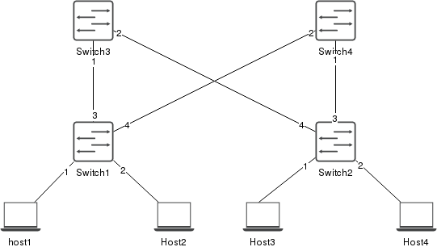
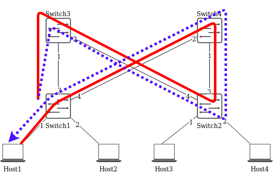
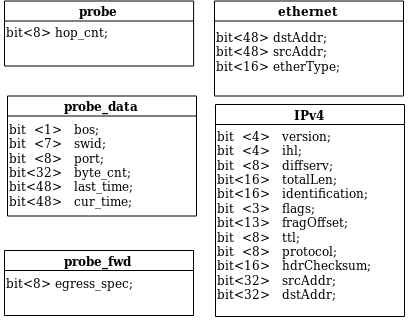
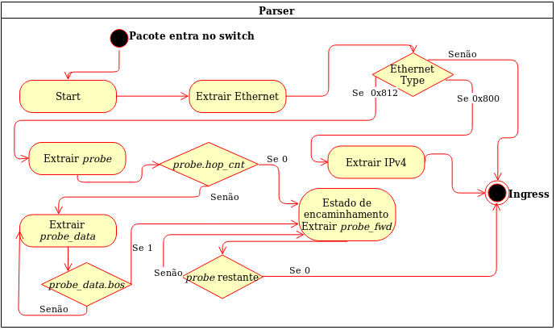
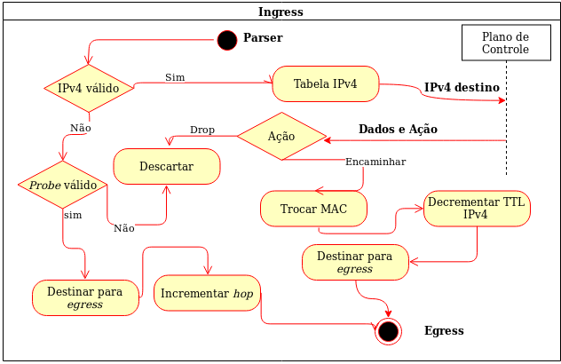
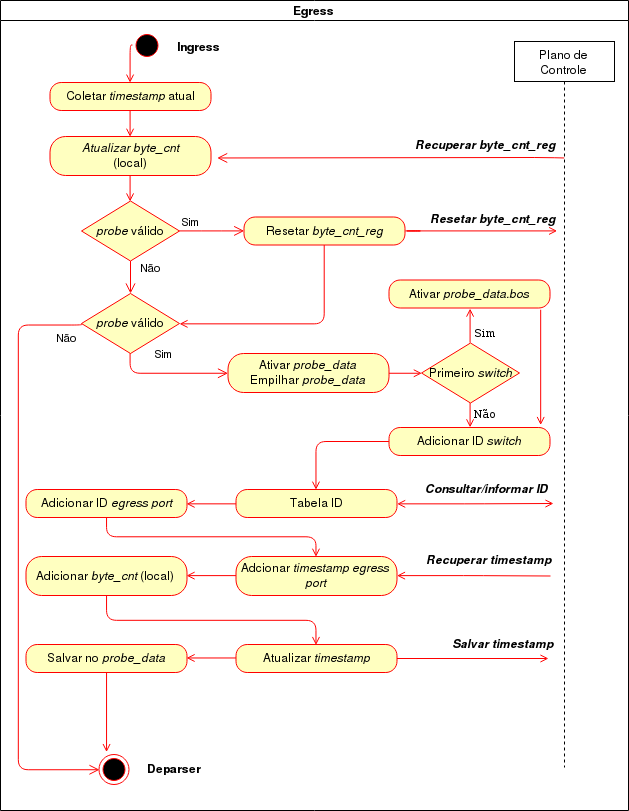

# P4 LINK MONITOR

A topologia criada para verificar a utilização das interfaces é a topologia apresentada na figura abaixo, com 4 switches e 4 hosts.

Nesse software possuirá um pacote quem tem uma rota específica que passa por todos os switches e captura os dados de todas as interfaces de saída de cada salto, o caminho está ilustrado abaixo:

Os cabeçalhos desenvolvidos para esse pacote que realiza uma coleta de informações diretamente, plano de dados é constituído por:

Estrutura de programação da etapa de Parser, deve seguir o diagrama abaixo:

Nesta passo fica o "ingress" que é a etapa que decide para onde esse pacote deve seguir dentro do equipamento, essa estrutura possui interação com o plano de controle, que tem a função de validar as informações do plano de dados e encaminhar as ações e dados para destina o pacote para interface correta.

O "egress" foi muito utilizado nessa etapa, pois o processamento de saída vai ser responsável por capturar os dados do switches, adicionar essas informações dentro do cabeçalho do pacote de maneira organizada.

As imagens acima representa toda a estrutura logica do software desenvolvido para realizar a coleta de dados no plano de dados, de maneira ágil e eficaz.

Para executar o teste no software, deve entrar na pasta "link_monitor" e executar o comando:

    make run

Vai compilar o P4 e realiza a montagem da infra-estrutura de rede, para esse teste.

Abra dois terminais do Host1, com o comando abaixo:

    mininet> xterm h1 h1

Em um dos terminais, o participante, vai encaminhar os pacotes que realiza a captura dos dados.

    ./send.py

No outro terminal o participante executa um arquivo em python que recebe os dados e mostra os valores.

    ./receive.py

Utilizando o software "Iperf" será gerado trafego nas interfaces para que seja possível verificar o link-monitor capturando esses dados:

    mininet> iperf h1 h4

Para finalizar a análise, basta executar o comando "quit" no mininet e ao voltar ao terminal executar os dois comandos abaixo:

    make stop
    make clean

* Observações Importantes: O detalhamento de cada função e etapa será apresentado no mini-curso.